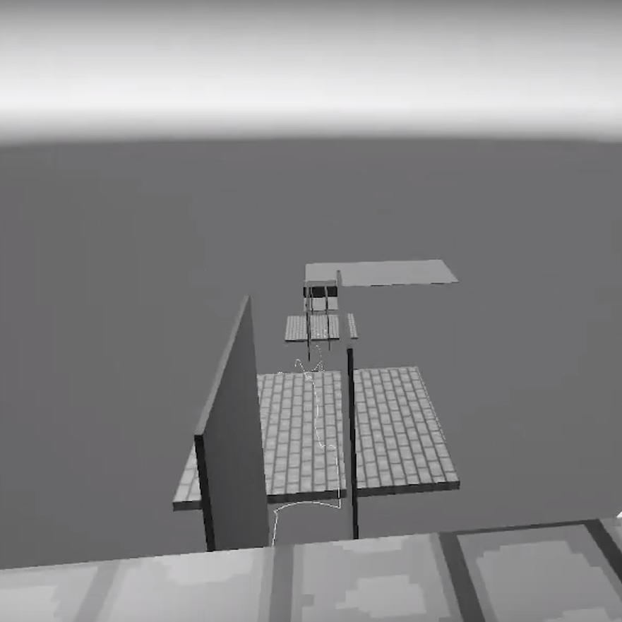
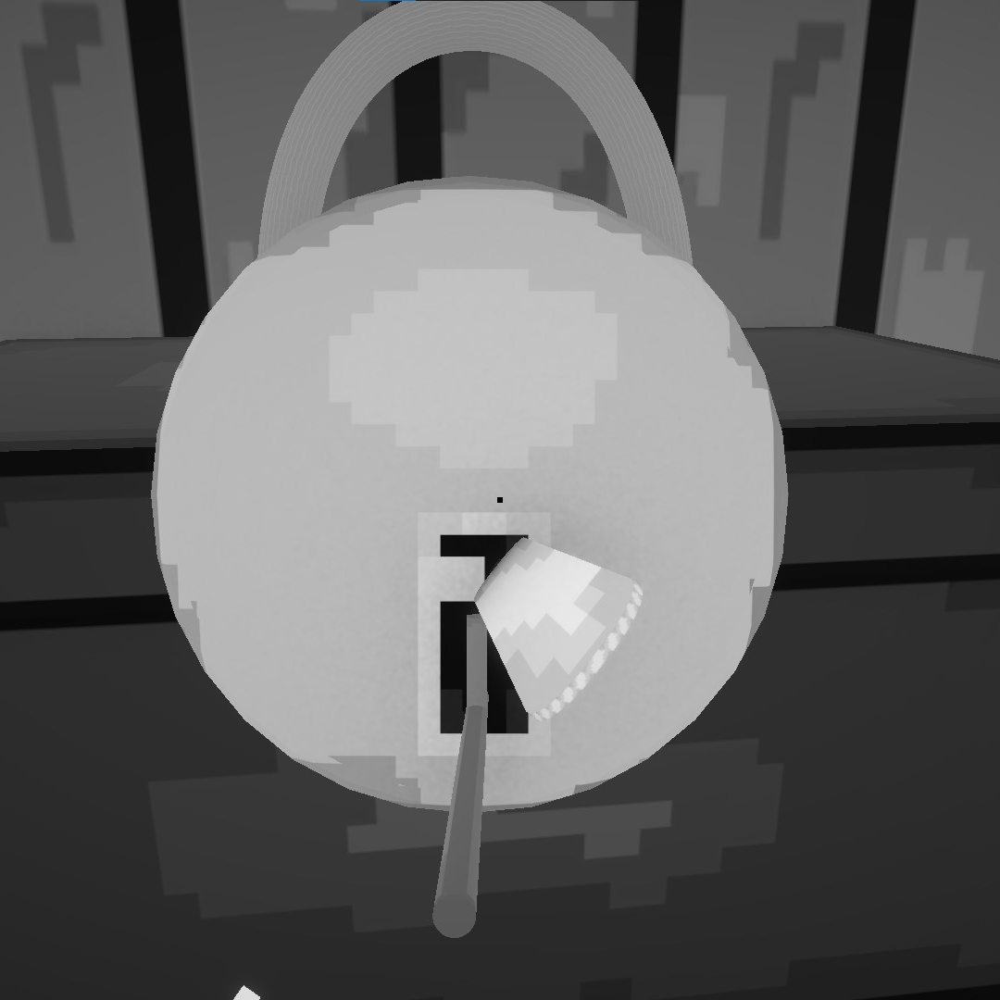

<html lang="en">
<head>
  <meta charset="UTF-8" />
  <meta name="viewport" content="width=device-width, initial-scale=1.0"/>
  <meta http-equiv="X-UA-Compatible" content="ie=edge"/>
  <title>Mantas Krutulis Portfolio</title>
  
</head>

<body>

  <nav>
    

      <a class="name" href="https://kubas-13.github.io/Portfolio/"><strong>Mantas Krutulis</strong></a>
      <h2>Game Developer</h2>
    

    

    <a href="https://kubas-13.github.io/Portfolio/">HOME</a>
      <a href="https://kubas-13.github.io/Demo/">DEMOS</a>
      <a href="https://kubas-13.github.io/Games/">GAMES</a>
      <a href="https://kubas-13.github.io/Contact/">CONTACT</a>
    

  </nav>

  <section class="section-header">
    <h2><strong>DEMOS</strong></h2>
  </section>

  <section class="video-section">
    

      <strong>Movement System</strong>
      
    

    

      <strong>Lockpicking System</strong>
      
    

  </section>

  <section class="code-section">
    

      <h2><strong>CODE</strong></h2>
    

    

      <a href="https://github.com/kubas-13/mantaskrutulis.github.io/tree/main/Code%20Examples/MovemetSystem" target="_blank">
        ➤ Movement System Code Example
      </a>
      <a href="https://github.com/kubas-13/mantaskrutulis.github.io/tree/main/Code%20Examples/LockpickingSystem/LootBox" target="_blank">
        ➤ Lockpicking System Code Example
      </a>
    

  </section>

</body>
</html>
